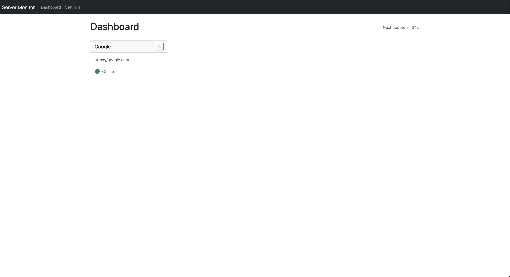

# API Health Checker

<p align="center">
  
  
  
</p>

A simple but powerful full-stack application to monitor the health and status of your servers and APIs in real-time.

## Features

- **Real-time Dashboard**: A dashboard of cards showing the live status of all monitored servers.
- **Nuanced Statuses**: Servers are classified as `Online` (2xx response), `Degraded` (4xx/5xx response), or `Offline` (network error).
- **Live Countdown Timer**: Shows a synchronized countdown to the next automatic refresh cycle.
- **Real-time Updates**: Uses WebSockets to push status updates from the backend to the frontend instantly.
- **Persistent Storage**: The server list and settings are saved to a `database.json` file, so your data is safe between restarts.
- **Full CRUD Management**: A settings page to Add, Edit, and Delete servers.
- **Token Authentication**: Supports monitoring endpoints that require a Bearer token.
- **Manual Retry**: Instantly re-check the status of any server with a click of a button.
- **Containerized**: The entire application is containerized with Docker and runs with a single command.

## Tech Stack

- **Frontend**: React, TypeScript, Bootstrap, Bootstrap Icons
- **Backend**: Node.js, Express, TypeScript, WebSockets (`ws`)
- **Containerization**: Docker, Docker Compose

## Getting Started

### Prerequisites

- [Docker](https://www.docker.com/get-started) must be installed and running on your machine.

### Installation & Usage

1. **Clone the repository:**
   ```bash
   git clone <your-repository-url>
   ```

2. **Navigate to the project directory:**
   ```bash
   cd api-health-checker
   ```

3. **Run the startup script:**
   This script will build the Docker images and start both the frontend and backend services.
   ```bash
   ./start.sh
   ```

4. **Access the application:**
   Open your browser and navigate to **[http://localhost:5102](http://localhost:5102)**.

### Stopping the Application

To stop all the running services, run the following command from the `api-health-checker` directory:

```bash
docker compose down
```

## Development

For developers who wish to run the services manually without Docker:

1. **Run the backend (Terminal 1):**
   ```bash
   cd monitor-api
   npm install
   npm run dev
   ```

2. **Run the frontend (Terminal 2):**
   ```bash
   cd server-monitor
   npm install
   npm start
   ```

The application will be available at **http://localhost:5100**.
